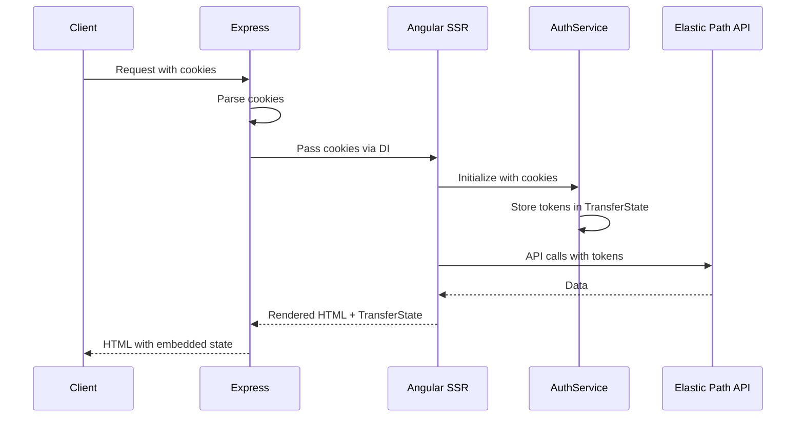
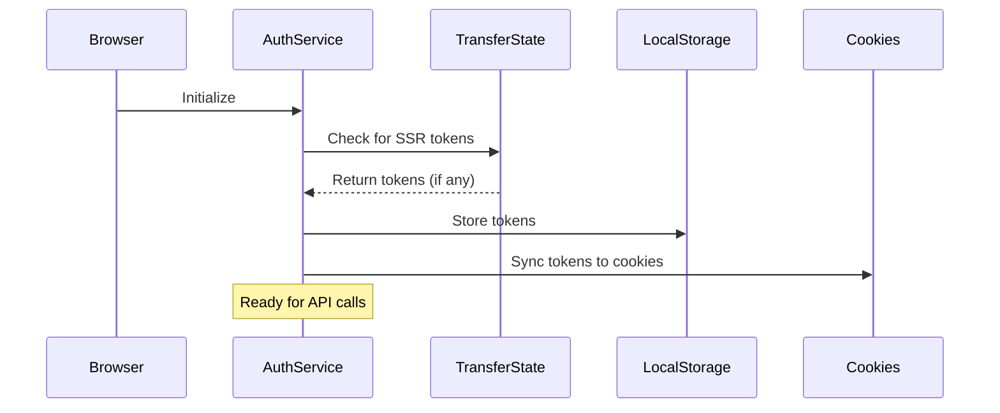

# SSR Authentication with Elastic Path

This document explains how authentication is shared between client and server-side rendering in this Angular application.

## Overview

The authentication system is designed to work seamlessly across both server-side rendering (SSR) and client-side hydration, ensuring that:

1. Authentication tokens are preserved during SSR
2. No duplicate API calls are made after hydration
3. Tokens are securely shared via cookies
4. The authentication state is transferred from server to client

## Architecture

### Key Components

1. **AuthService** (`src/app/services/auth.service.ts`)
   - Platform-aware service that handles tokens differently on server vs client
   - Uses Angular's TransferState to pass tokens from server to client
   - Supports both implicit tokens and account management tokens

2. **CookieService** (`src/app/services/cookie.service.ts`)
   - Manages cookie operations in a platform-safe way
   - Only operates in the browser environment
   - Handles secure cookie settings

3. **Server Cookie Provider** (`src/app/providers/server-cookie.provider.ts`)
   - Injects cookies from the Express request into the AuthService during SSR
   - Runs only on the server

4. **Auth Initializer** (`src/app/services/auth.initializer.ts`)
   - Sets up cookie synchronization on the client
   - Ensures tokens are stored in cookies when they change
   - Attempts to obtain a valid token on app startup

## How It Works

### 1. Server-Side Rendering Flow



### 2. Client-Side Hydration Flow



### 3. Token Storage Strategy

| Storage | Purpose | Lifetime |
|---------|---------|----------|
| **Cookies** | Share tokens between client and server | Until expiry |
| **LocalStorage** | Client-side persistence | Until cleared |
| **TransferState** | SSR to client transfer | Page load only |
| **Memory** | Active session state | Application lifetime |

## Implementation Details

### Cookie Configuration

Cookies are set with the following security settings:
- `Secure`: Always true (HTTPS only)
- `SameSite`: Lax (CSRF protection)
- `HttpOnly`: False (needs to be readable by JavaScript)
- `Path`: / (available across the app)

### Token Types

1. **Implicit Token** (`ep_implicit_token`)
   - Required for all API calls
   - Short-lived (1 hour)
   - Auto-refreshed when expired

2. **Account Token** (`ep_account_token`)
   - Optional, for authenticated users
   - Provides access to user-specific resources
   - Longer-lived

## Usage Examples

### Checking Authentication Status

```typescript
import { AuthService } from './services/auth.service';

@Component({...})
export class MyComponent {
  constructor(private authService: AuthService) {}

  ngOnInit() {
    // Check if authenticated
    if (this.authService.isAuthenticated()) {
      // User has valid tokens
    }

    // Subscribe to auth changes
    this.authService.tokens$.subscribe(tokens => {
      // React to token changes
    });
  }
}
```

### Making Authenticated API Calls

```typescript
import { getByContextAllProducts } from '@epcc-sdk/sdks-shopper';

async loadProducts() {
  // AuthService automatically attaches tokens via SDK interceptors
  const products = await getByContextAllProducts();
  return products;
}
```

### Manual Token Management

```typescript
// Generate new implicit token
await this.authService.generateImplicitToken();

// Set account token (after user login)
this.authService.setAccountToken(accountToken);

// Clear all tokens (logout)
this.authService.clearTokens();
```

## Security Considerations

1. **XSS Protection**: Tokens are stored in cookies with `SameSite=Lax`
2. **HTTPS Required**: Cookies are marked as `Secure`
3. **Token Expiry**: Implicit tokens expire after 1 hour
4. **Automatic Refresh**: Expired tokens are refreshed automatically

## Debugging

### Common Issues

1. **Tokens not persisting after page reload**
   - Check browser cookies are enabled
   - Verify HTTPS is being used
   - Check cookie domain settings

2. **SSR not using authentication**
   - Verify cookies are being sent with requests
   - Check server.ts cookie parsing
   - Ensure SERVER_COOKIE_PROVIDER is registered

3. **Duplicate API calls after hydration**
   - Verify TransferState is working
   - Check that tokens are being transferred
   - Ensure client reuses SSR data

### Debug Mode

Enable debug logging by adding to your component:

```typescript
ngOnInit() {
  this.authService.tokens$.subscribe(tokens => {
    console.log('Current tokens:', tokens);
  });
}
```

## Best Practices

1. **Always use the AuthService** - Don't manually manage tokens
2. **Handle token expiry** - Use the provided refresh mechanisms
3. **Secure your cookies** - Always use HTTPS in production
4. **Clean up on logout** - Call `clearTokens()` to remove all auth data
5. **Test SSR behavior** - Verify authentication works with JavaScript disabled

## Future Enhancements

Consider implementing:
1. Refresh token support
2. HttpOnly cookies with a BFF pattern
3. Token rotation strategies
4. Session timeout warnings
5. Multi-tab synchronization